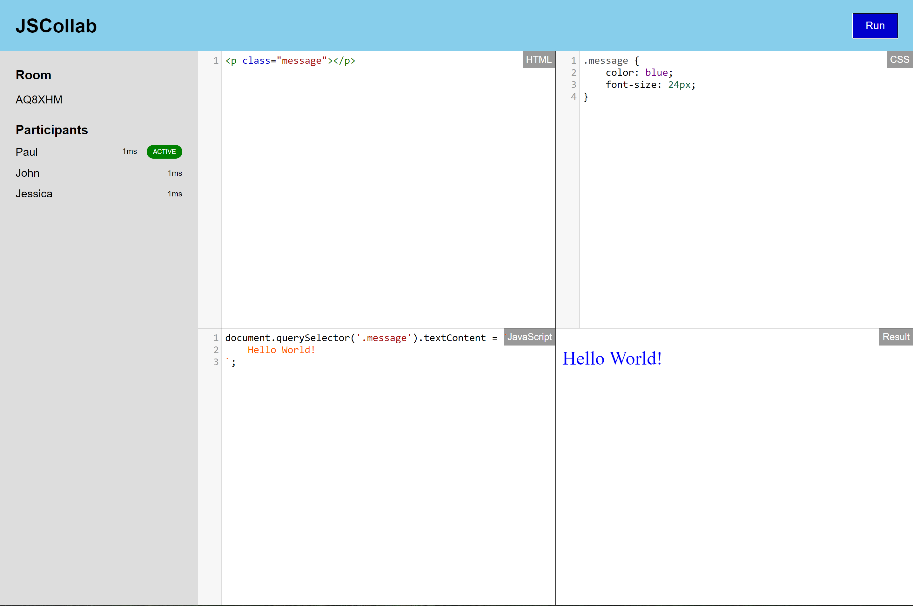

# JSCollab

Simple non-persistent JavaScript, HTML and CSS code sandbox app, where multiple developers can join, modify the code and see the code being modified. Intended for conducting remote interviews.

## Features

* Create or join a room.
* Can see list of participants in a room.
* Only 1 user can control the editors at any time.
* Users not in control will see changes in real time.
* Separate section for HTML, CSS and JavaScript with a result window.
* All participants disconnecting from the room will wipe all content.